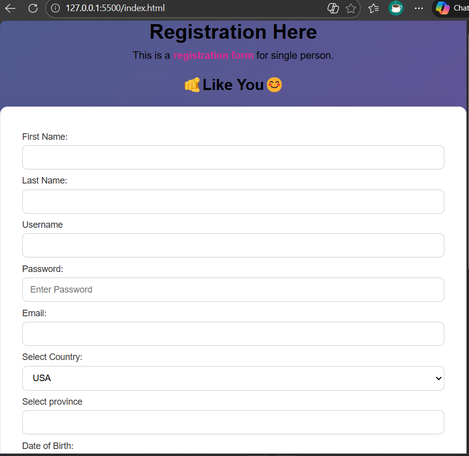

# HTML & CSS Registration Form

A registration form built using **HTML and CSS**, featuring various input fields, form controls, and basic structure for user data collection.  
This project demonstrates form creation using different HTML input types along with a clean layout styled using CSS.

---

## 🚀 Live Demo
🔗 https://vinodkumarjaipal.github.io/html-css-registration-form/

---

## 🖼️ Project Screenshot

---

## 📄 Project Description
This registration form was created as a practice project during my learning journey as a **Software Engineering student**.  
The purpose of this project is to demonstrate the use of multiple HTML form elements with CSS styling to create a structured and user-friendly registration form.

Although this project focuses on frontend form design, it supports my overall growth as a **Full-Stack Developer** by strengthening core frontend fundamentals.

---

## ✨ Features
- Input fields for first name and last name
- Username and password fields
- Email input type
- Date of birth selector
- Country selector dropdown
- Province datalist field
- Telephone number field
- Gender radio options
- Checkbox favorites
- File upload input
- Textarea for messages
- Internal styling using CSS

---

## 🛠️ Technologies Used
- HTML5
- CSS3

---

## 📂 File Structure
├── index.html
├── style.css
├── images/
├── screenshot.png
└── README.md

---

## 🎯 Learning Outcomes
- Building HTML forms with structured input fields
- Using form controls like dropdown, radio, checkbox, and datalist
- Styling forms using CSS
- Improving layout and readability with proper form grouping

---

## 👨‍💻 Author
**Vinod Kumar**  
Software Engineering Student  
Full-Stack Developer

🔗 GitHub Profile: https://github.com/vinodkumarjaipal

---

## 📌 Note
This project was built for learning and practice purposes and will be enhanced further as development skills continue to grow.
